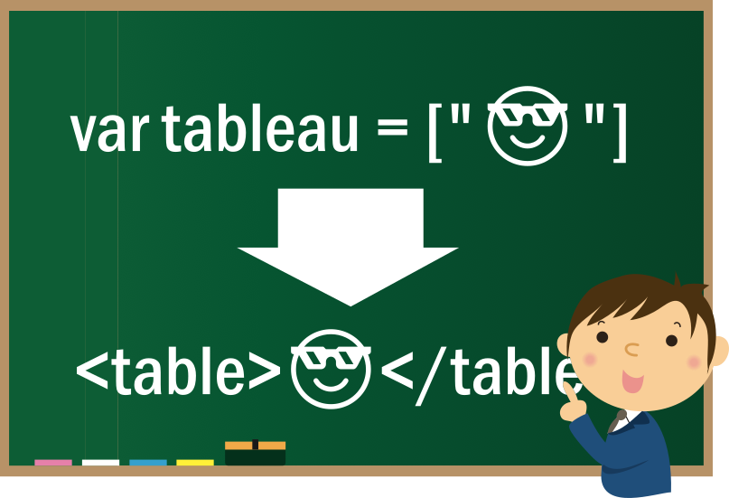

# Devoir : Tableau
On va faire un tableau avec des tableaux.


## Préparation en classe
1. Trouver un sujet. _Ex.: Le ski._
1. Trouver _au moins_ 3 objets ou individus représentant le sujet. _Ex.: Les 5 meilleurs skieurs des derniers jeux olympiques; 4 marques ou models de ski..._
1. Trouver 3 caractéristiques spécifiques aux individus. _Ex.: Nom, prénom, taille..._

## Le HTML brut
1. Créer un tableau en HTML brut avec les informations recueillis. En utilisant les balises typiques aux tableaux dont vous avec un exemple ci-dessous.

### Exemple de tableau de base
```
<table border="1">
    <thead>
        <tr>
            <th>Colonne 1</th>
            <th>Colonne 2</th>
        </tr>
    </thead>
    <tbody>
        <tr>
            <th>Rangée 1</th>
            <td>Donnee 1</td>
        </tr>
    </tbody>
</table>
```

## Le projet
1. Mettre les informations dans un ou des tableaux (array) _Javascript_
## Remise
- Travail individuel.
- Durée : une semaine. À remettre avant le cours __une semaine__ après la réception.
- Compte pour __5%__ de la note finale.
- Renommer le dossier `NOMP0123456_tableau` AVANT de le zipper pour le remettre dans le projet correspondant sur [remise.cstj.qc.ca](https://remise.cstj.qc.ca).

