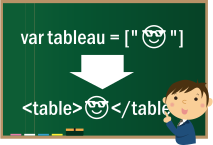

# Devoir : Tableau

On va faire un tableau avec des tableaux.


## Préparation en classe

1. Trouver un sujet. _Ex.: Le ski._
2. Trouver _au moins_ 3 objets ou individus représentant le sujet. _Ex.: Les 5 meilleurs skieurs des derniers jeux olympiques; 4 marques ou models de ski..._
3. Trouver 3 caractéristiques spécifiques aux individus. _Ex.: Nom, prénom, taille..._

## Le HTML brut

1. Créer un tableau en HTML brut avec les informations recueillies. En utilisant les balises typiques aux tableaux dont vous avec un exemple ci-dessous.

### Exemple de tableau de base

```html
<table border="1">
    <thead>
        <tr>
            <th scope="col">Colonne 1</th>
            <th scope="col">Colonne 2</th>
            ...
        </tr>
    </thead>
    <tbody>
        <tr>
            <th scope="row">Rangée 1</th>
            <td>Donnee 1</td>
            ...
        </tr>
        ...
    </tbody>
</table>
```

## Le projet

1. Créer un tableau avec les noms des 3 caractéristiques. Ex.: `["Nom", "Prénom", "Taille"]`
2. Mettre les informations dans 3 tableaux (array) _Javascript_. Faire 1 tableau par caractéristique.
3. _Optionnellement_, vous pouvez rassembler ces 3 tableaux dans un tableau parent.
4. Reproduire le tableau `<table>` à l'aide de boucles (2 boucles : une pour les noms et une pour les individus).
5. Faire une **petite** mise en page CSS (_C'est un cours de Web après tout._).

## Remise

- Travail individuel.
- Durée : Une semaine. À remettre avant le cours **une semaine** après la réception.
- Compte pour **5%** de la note finale.
- Renommer le dossier `NOMP0123456_tableau` **AVANT** de le zipper pour le remettre dans le devoir correspondant dans Teams.
